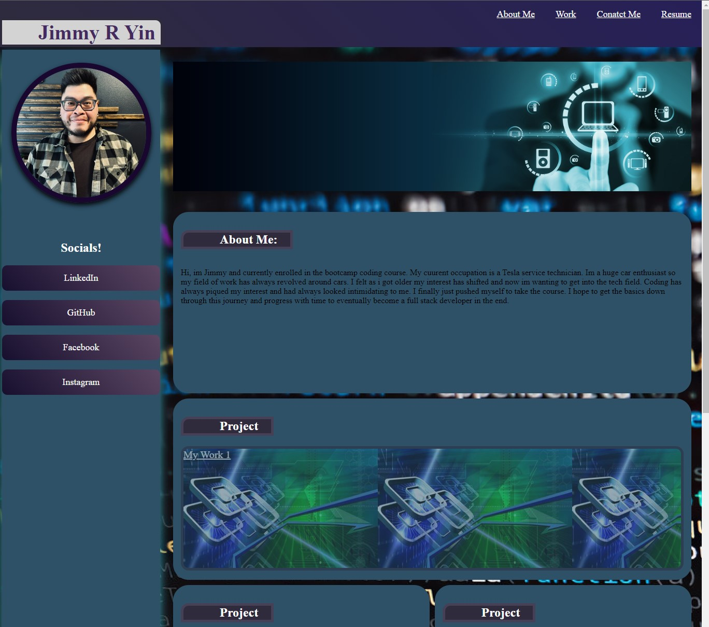

# Jimmys-Portable-Portfolio

## Description

My motivation for this project was to have a professional portfolio for myself and showcase my future work.  Building this project from scratch was not easy and had but help me gain more exposure to HTML and CSS.  This was an intimidating task and i hope to overcome this feeling as I continue to build other projects outside of class.  

Please note:
My facebook has been disabled to help me focus with studies.
I have yet to creat a Linkedin profile and working on that.

## Installation

N/A

## Usage
https://xkranze.github.io/Jimmys-Portable-Portfolio/
 

## Credits
https://stackoverflow.com/ - used to look up numerous questions i had.

## License
N/A